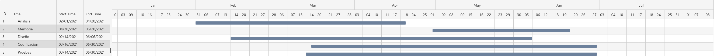

# Memoria del proyecto

## Indice

# Tabla de Contenidos

- [Introducción](#introducción)
- [Planificación Temporal](#planificación_temporal)
- [Objetivos](#objetivos)
  - [Tecnologias Seleccionadas](#tecnologias_seleccionadas)
    - [Lenguajes](#lenguajes)  
    - [Front-End](#front-end)  
    - [Back-End](#back-end)  
  - [Requisitos](#requisitos)
- [Desarrollo](#desarrollo)
  - [Diseño](#diseño)
  - [Codificación](#codificación)
  - [Pruebas](#pruebas)
- [Conclusiones](#conclusiones)
  - [Tiempo Invertido](#tiempo_invertido)
- [Integracion de modulos dentro del proyecto](#integracion-de-modulos-dentro-delproyecto)
- [Glosario](#glosario)
- [Bibliografia](#bibliografia)

## Introducción

## PLaificación Temporal

 

## Objetivos

### Tecnologias seleccionadas

Las Tecnologuias en este proyecto, han sido seleccionadas por medio de un analisis y un razonamiento basico tratando de utilizar lenguajes utilizados o aprendidos a lo largo de los dos años de formación.

Las debidas explicaciónes sobre ello, se han partido en tres secciones.

#### Lenguajes

En esta sección se aclaran las razones por las cuales se han elegido los diferentes lenguajes de programación.

A lo largo de el curso, hemos podido ver diferentes lenguajes desde los interpretados a los compilados, pasando por los orientados a objetos y se nos ha enseñado las principales diferencias entre este y otros tipos como los procedurales, aparte de ello también se nos ha introducido en los diferente niveles de complejidad.

De mayor complejidad siendo "lenguaje maquina", o en resumidas cuentas el lenguaje que entiende el ordenador.

Y los de menor complejidad, significando esto que los de este tipo son más faciles de entender para el ser humano.

En resumidas cuentas hay una alta dispariedad de tipos de lenguajes a la vez de una cantidad exageradamente alta y en incremento, aparte de que cada uno sirve para diferentes tipos de necesidad exacta u explicita, esto hace que a la hora de seleccionar un tipo de lenguaje concreto esta propia selección se convieta en un proceso bastante más "conplicado" o difuso.

En este caso los lenguajes seleccionados has sido escogidos en base a las experiencias a lo largo del modulo.

Los lenguajes seleccionados son: 

Javascript: Es un lenguaje orientado a objetos basado en java el cual se ha impartido en este ultimo año, es un lenguaje muy utilizado de muchas formas distintas, permite el uso de funcionalidades asyncronas utilizando conceptos como el event loop, y es un lenguaje con el cual se puede trabajar tanto en *front-end* como en *back-end* haciendo de el una opción muy interesante y completa para cualquier proyecto.

HTML/CSS: Los lenguajes de maquetación y estilos para paguinas web los cuales resultan imprescindibles a la hora de diseñar una paguina u aplicación web.

Estructura Mongodb: La estructura de bases de datos de mongodb en concreto no se dió en clase, es una estructura de bases de datos que se compone por esquemas la cual se configura de una forma similar a un fichero .JSON, la razón por la que se escogio este tipo de base de datos fue porque a la hora de investigar daban buenas opiniones sobre ello y aparte resulta muy interesante/intrigante aprender un nuevo sistema de bases de datos.

Una vez explicados los motivos de estos lenguajes, pasamos a explicitar que esta destinado a que parte del desarrollo.

#### Fornt-End

Para el Front-End nada más iniciar la busqueda con total facilidad se puede ver, que los frameworks son una buena idea para el desarrollo de este aspecto. 

Y en lo que se refiere a frameworks de front-end sobre el lenguaje seleccionado, los más nombrados o con más fama són:

*Angular.js*
*Vue.js*
*React.js*
*Svelte.js*

Cada uno tiene sus puntos fuertes y sus puntos debiles, algunos son más querido por la comunidad y otros simplemente odiados como Angular.js, pero cada uno de ellos merecen la pena ser utilizados en concreto svelte es el más "joven" de los cuatro pero sus ratios de aceptación por la comunidad y uso son muy elevados para lo que se esperaria de un framework desarrollado hace escasos 4 años.

En este caso se selecciono Vue.js ya no solo por su capacidad de escalado que en ciertos sentidos puedes ser superior a la de sus compañeros, si no que tambien la curva de dificultad en respectiva a las otras conjunto a svelte es la menos "empinada" por así decirlo.

La versión en concreto que se usa es la de @Vue/cli: 4.5.12, que es un tipo de version de Vue.js la cual implementa una larga serie de funcionalidades, la más notoria es que utiliza *webpack* para la construcción de la estructura de paquetes en nuestro repositorio.

Una vez explicado el framework a utilizar ya no queda mucho más por explicar en esta parte, así que damos paso a el apartado de back-en.

#### Back-End

Para el back-end en este caso no exsitian muchas opciones o vias alternas, con javascript las opciones para back-end son utilizando *node.js* y *express*, integrando *mongodb* como base de datos.

*Node.js* es un tipo de runtime environment o medio ambiente de tiempo en ejecución que basicamente lo que permite en resumidas cuentas hacer, es utilizar y ejecutar javascript sin un "navegador" de por medio.

*Express*: Un framework de Node.js que permite construir apis.

*Mongodb*: El sistema de Base de Datos de Mongo esta basado en JavaScript permite crear bases de datos atraves de esquemas.  

Una vez explicadas las elecciones proseguimos con los requisitos.

### Requisitos

```
I.Req: Ha de existir un usuario administrador que se encarge de la modificación, eliminación y agrgación de productos y pedidos.

II.Req: Aparte del usuario administrador, también existirán otros dos tiposs, registrado y anonimo.

III.Req: El usuario anonimo solo podrá accerder a las funciones basicas de la paguina pero en el momneto de intentar realizar un pedido o agregar productos al carrito, se les demandara que se registren para continuar.

IV.Req: El usuario registrado podra realizar las mismas actividades que uno anonimo pero con la diferecia de que estos pueden realizar pedidios, añadir objetos al carrito y modificar su información de usuario.

V.Req: El usuario registrado podrá cambiar información de usuario como: nombre o nick, contraseña, dirección y otros tipos de información basica relativas al usuario.

VI.Req: El filtrado de productos será de forma cronologica.

VII.Req: Los usuarios no podrán pedir más de 3productos.

VIII.Req: Solo se les permitira a los usuarios realizarun pedido, hasta que este no sea entregado no se lespermitira realizar otro.

IX.Req: Dejar constancia de que no puedo venderproductos.

X.Req: Los productos tendrán un tipo de etiqueta o tag que los identifique.

XI.Req: La función de carrito de compra nos mostrará el numero de productos que hemos selecionado para tener constancia de ello.
```

## Desarrollo

### Analisis

### Diseño

### Codificación

### Pruebas

## Conclusiones

### Tiempo invertido

## Integración de modulos dentro del proyecto

## Glosario

### Terminos Usados:

front-end:
back-end:
Webpack:
Angular.js
Vue.js
React.js
Svelte.js
Mongodb:
Express:
Node.js:

## Bibliografia

### Información consultada

Sacha Greif and Raphaël Benitte, (20 de mayo de 2020). State of JS. <https://2020.stateofjs.com/en-US/>

Sacha Greif and Raphaël Benitte, (20 de mayo de 2020). State of CSS. <https://2020.stateofcss.com/en-US/other-tools/>

El equipo de Vue.js. (2021-03-24). Introducción a Vue.js. <https://v3.vuejs.org/guide/migration/introduction.html#quickstart>

El equipo de Vue.js. (10/7/2019). Introducción a Vue.js cli. <https://cli.vuejs.org/guide/>

El equipo dec Sass. (2006–2021). Documentación de Sass. <https://sass-lang.com/documentation>

El equipo de Git. (Sin especificar). Documentación de Git. <https://git-scm.com/doc>

El equipo de Node.js. (20 de mayo de 2020). Node.js v14.16.1 Documentación. <https://nodejs.org/dist/latest-v14.x/docs/api/>

Apellido, A., Apellido, B., y Apellido, C. (CR: en febreo pero no se especifica dia). Nodemon. <https://www.npmjs.com/package/nodemon>

El equipo de bitbucket altassian. (Sin especificar). .gitignore. <https://www.atlassian.com/git/tutorials/saving-changes/gitignore>
