# Clorophyll prototipo de Floristeria Online.


# Tabla de Contenidos


- [Introducción](#introducción)
- [Planificación Temporal](#planificación_temporal)
- [Objetivos](#objetivos)
  - [Tecnologias Seleccionadas](#tecnologias_seleccionadas)
    - [Lenguajes](#lenguajes)  
    - [Front-End](#front-end)  
    - [Back-End](#back-end)  
  - [Requisitos](#requisitos)
- [Desarrollo](#desarrollo)
  - [Diseño](#diseño)
    - [Diagramas](#diagramas)
  - [Codificación](#codificación)
    - [CRUD](#CRUD)
    - [Autentificación](#Autentificación)
    - [Implementación en Front-end](#implementación_Front-end)
    - [Corrección de errores](#correción_errores)
  - [Pruebas](#pruebas)
- [Historial de Commits](#historial_commits)
- [Conclusiones](#conclusiones)
  - [Tiempo Invertido](#tiempo_invertido)
- [Integracion de modulos dentro del proyecto](#integracion-de-modulos-dentro-delproyecto)
- [Glosario](#glosario)
  - [Terminos Empleados](#terminos_empleados)
- [Bibliografia](#bibliografia)
  - [Información consultada](#información_consultada)


## Introducción


En esta memoria se van a exponer los puntos tomados en cuenta a la hora de desarrollar el proyecto integrador de final de Gardo por parte de Carlos Rojas Fernández.

A la hora de proseguir con la explicación de este proycto, es conveniente aclarar desde el principio la finalidad del mismo.


El proyecto tiene como finalidad:

- Aprender el desarrollo en Javascript, un leguaje muy famoso el cual tiene una gran comunidad detras.

- Aprender la creación y desarrollo de una *"API"*.

- Comprender el desarrollo del *Back-End* o lado servidor en JavaScript.

- Y aprender la implementación e uso de un *Front-End* utilizando el framework *Vue.js*.


Todo este proyecto es desarrollado teniendo en mente las finalidades anteriores, dados los puntos a la hora de escojer la tematica se decido desarrollar una floristeria online.

Como pretexto para poder realizar, operaciones de *CRUD*, Autenticación, Diseño y como no Bases de Datos.

Cosas que quitando el apartado de diseño, se ven reflejadas en la *"API"* contruida en el *Back-End*.

Una vez explicacdos los puntos importantes, podemos pasar al siguiente apartado.


## PLaificación Temporal


En este apartado se dará a entender la importancia de la Planificación temporal y se enseñara un "Diagrama temporal" realizado al principio del desarrollo.

La planifiación temporal es sumamente imporatante a la hora de empezar cualquier clase de proyecto.

Todas las empresas que se dedicacan a el desarrollo de cualquier tipo de servicio, cominezan siempre con la confección de una buena planificación temporal, lo cual ayuda a esquematizar el tiempo invertido y no malgastarlo.

Pero esto ya no se aplica solamente a las empresas grandes, todo ser humano que realize una actividad de cualquier tipo u caracter muchas veces se verá afectad@ por la idea de no malgastar su tiempo y esto traducido al desarrollo de un proyecto, aplicación etc...

Puede ser un problema muy grande, e ahí la razón por la cual la planificación temporal es esencial a la hora de equematizar las tareas y el numero de horas que se les va a otorgar.

Una vez explicado el punto, paso a enseñar mi propia Planificación:


En ella se ha recabado lo que podrá será la cantidad de tiempo necesitada para poder completar este proyecto.

Más adelante en el transcurso de esta propia memoria se expondrá la verdadera cantidad de tiempo utilizada:

[Tiempo Invertido](#tiempo_invertido)

Una vez terminado con este apartado proseguimos a los objetivos.


## Objetivos

En este apartado se expondrán los objetivos  a alcanzar y la parte de desarrollo correspondiente a los proximos aparatados.

### Tecnologias seleccionadas


Las Tecnologias en este proyecto, han sido seleccionadas por medio de un analisis y un razonamiento "basico", tratando de utilizar lenguajes aprendidos y practicados a lo largo de los dos años de formación.

Las debidas explicaciónes sobre ello, se han partido en tres secciones.


#### Lenguajes


En esta sección se aclaran las razones por las cuales se han elegido los diferentes lenguajes de programación.

A lo largo de el curso, hemos podido ver diferentes lenguajes desde los interpretados a los compilados, pasando por los orientados a objetos y se nos ha enseñado las principales diferencias entre este y otros tipos como los procedurales, aparte de ello también se nos ha introducido en los diferente niveles de complejidad.

De mayor complejidad siendo "lenguaje maquina", o en resumidas cuentas el lenguaje que entiende el ordenador.

Y los de menor complejidad, significando esto que los de este tipo son más faciles de entender para el ser humano.

En resumidas cuentas hay una alta dispariedad de tipos de lenguajes a la vez de una cantidad exageradamente alta y en incremento (relativo), aparte de que cada uno sirve para diferentes tipos de necesidad exacta u explicita, esto hace que a la hora de seleccionar un tipo de lenguaje concreto esta propia selección se convieta en un proceso bastante más "conplicado" o difuso.

En este caso los lenguajes seleccionados han sido escogidos en base a las experiencias a lo largo de los modulos.

Los lenguajes seleccionados son:

Javascript: Un lenguaje orientado a objetos basado en java el cual se ha impartido en este ultimo año, es un lenguaje muy utilizado de muchas formas distintas, permite el uso de funcionalidades asyncronas utilizando conceptos como el *event loop*, y es un lenguaje con el cual se puede trabajar tanto en *front-end* como en *back-end* haciendo de el una opción muy interesante y completa para cualquier proyecto.

HTML/CSS: Los lenguajes de maquetación y estilos para paguinas web los cuales resultan imprescindibles a la hora de diseñar una paguina u aplicación web.

Mongodb: La estructura de bases de datos de mongodb en concreto no se dió en clase, es una estructura de bases de datos que se compone por esquemas la cual se configura de una forma similar a un fichero .JSON, la razón por la que se escogio este tipo de base de datos fue porque a la hora de investigar daban buenas opiniones sobre ello y aparte resulta muy interesante/intrigante aprender un nuevo sistema de bases de datos.

Una vez explicados los motivos de estos lenguajes, pasamos a explicitar que esta destinado a que parte del desarrollo.


#### Fornt-End


Para el Front-End nada más iniciar la busqueda con total facilidad se puede ver, que los frameworks son una buena idea para el desarrollo de este aspecto. 

Y en lo que se refiere a frameworks de front-end sobre el lenguaje seleccionado, los más nombrados o con más fama són:

*Angular.js*
*Vue.js*
*React.js*
*Svelte.js*

Cada uno tiene sus puntos fuertes y sus puntos debiles, algunos son más querido por la comunidad y otros simplemente odiados como Angular.js, pero cada uno de ellos merecen la pena ser utilizados en concreto svelte es el más "joven" de los cuatro pero sus ratios de aceptación por la comunidad y uso son muy elevados para lo que se esperaria de un framework desarrollado hace escasos 4 años.

En este caso se selecciono Vue.js ya no solo por su capacidad de escalado que en ciertos sentidos puedes ser superior a la de sus compañeros, si no que tambien la curva de dificultad en respectiva a las otras conjunto a svelte es la menos "empinada" por así decirlo.

La versión en concreto que se usa es la de @Vue/cli: 4.5.12, que es un tipo de version de Vue.js la cual implementa una larga serie de funcionalidades, la más notoria es que utiliza *webpack* para la construcción de la estructura de paquetes en nuestro repositorio.

Una vez explicado el framework a utilizar ya no queda mucho más por explicar en esta parte, así que damos paso a el apartado de back-en.


#### Back-End


Para el back-end en este caso no exsitian tantas opciones o vias alternas como en la parte de *frameworks* de *front-end*, con javascript una de las opciones para back-end son utilizando *node.js* y *express*, integrando *mongodb* como base de datos.

*Node.js* es un tipo de runtime environment o medio ambiente de tiempo en ejecución que basicamente lo que permite en resumidas cuentas hacer, es utilizar y ejecutar javascript sin un "navegador" de por medio.

La razón por la que se utiliza es bastante simple, en su trabajo hay bastantes opciones distintas, *deno* creado por uno de los fundadores de *node*, y otras varias...

Pero al no tener una especificación precisa sobre un tema concreto que se salga de la zona de acción de node, se decidio usar este ya no solo por esa razón si no por que también tiene un gran comunidad y existia un interes grande por aprender a utilizar la susodicha herramienta.

*Express*: Un framework de Node.js que permite construir *APIs* lo cual supone una condición ya no solo una condición principal del trabajo, si no también una parte clave del desarrollo *back-end* aparte de ello.

La razón principal por la que se decidió utilizarlo es porque es el *Web Framework*, más estandarizado e utilizado por toda la comunidad, tiene competidores como por ejemplo *Fastify* pero no le suponen mucha competición.

*Mongodb*: El sistema de Base de Datos de Mongo esta basado en JavaScript permite crear bases de datos atraves de esquemas o Schemes en ingles, este tipo de Sisteama de BD crea o almacena los datos en "documentos JSON", los cuales representan los datos que tiene cada objeto aparte de que es de tipo *NOSQL* lo cual facilita bastante el trabajo, y no se combierte todo en un enrredo de constraints y relaciones.  

Una vez explicadas las elecciones proseguimos con los requisitos.


### Requisitos


```
I.Req: Han de existir 2 tipos de usuarios o roles, el de "admin" o "administrador" y el de "user" o usuario registrado, aparte del "usuario anonimo" que no es un tipo de usuario registrado.

II.Req: El usuario anonimo solo podrá accerder a las funciones basicas de la paguina como ver los productos y entrar en los componentes publicos como Home, login, "register" o registro.

III.Req: El usuario registrado podra realizar las mismas actividades que uno anonimo pero con la diferecia de que estos pueden realizar pedidios y añadir objetos al carrito.

IV.Req: El filtrado de productos será de forma cronologica o bien por orden de agregación u creación.

V.Req: Solo se les permitira a los usuarios realizar un pedido, hasta que este no sea entregado no se les permitira realizar otro.

VI.Req: Los productos tendrán un tipo de etiqueta o tag que los identifique.

VII.Req: La función de carrito de compra nos mostrará el numero de productos que hemos selecionado para tener constancia de ello.
```


## Desarrollo


En el apartado de Desarrollo se expondrán los distintos procedimientos que se llevaron acabo a la hora de desarrollar el proyecto.

Fromando una lista con los segmentos restantes que froman parte de este bloque:

La primera fase dentro del Desarrollo la fase **Diseño** donde se expondran los esquemas, "bocetos" y ideas principales sobre las que se desarrolla el proyecto.

Al terminar con el apartado de diseño comenzará la **Codificación**, que es el proceso donde comienza la edificación o construcción del proyecto por medio del codigo.

Y para finalizar, un apartado sobre **Pruebas** donde se expondran las difrentes pruebas o "tests" que han sido realizadas, mediante el desarrolllo del proyecto.

Este metodo de "modularización" por "ambitos" dentro del desarrollo permite estructurar la maquetación del mismo de una forma ordenada y procedimental.


### Diseño


En este apartado se reflejaran lo diferentes procedimientos relacionados con el apartado en cuestión.

Cuando se quiere hablar sobre el diseño en sí de un aplicación, los temas pueden ser muy variados desde esquemás de caso y uso a esquemas de entidad relacional, mockups de componentes HTML o de paguinas en si etc...

Una amplia gama de "tipos de diseño" donde podemos escoger, en este caso a la hora de desarrollarlo solo se ha necesitado componer un par de esuqemas relacionados a conceptos clave en el desarrollo, sobre los cuales se necesitaba un entendimineto o comprensión más detallada.

Estos se verán reflejados en el siguiente apartado.


#### Diagramas

En los diagramas seleccionadso o realizados se han podido 


**Esquema sobre la  Base de Datos**


En este caso el tipo de Base de Datos empleado es *Mongodb* el cual es de tipo *NoSQL*.

De tal forma que al representar el tipo de datos y colecciones utilizadas se ha preferido mostrar los datos de una manera distinta, una usando la *GUI* de *Mongodb*, enseñando los inices que son la estructura que se utiliza en *Mongodb* dentro de cada colección, cada documento contiene la misma estructura representada en el inidice obviamenete con datos propios.  

Y enseñando un ejemplo de la estructura dentro de los "ficheros JSON" (con muchas comillas) en los que se encuentran los datos usados por cada "item".


**Ejemplo GUI:**


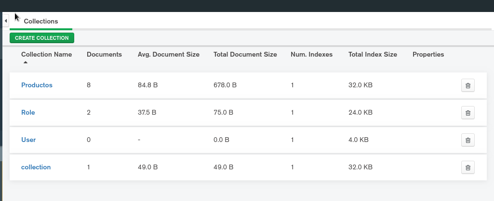


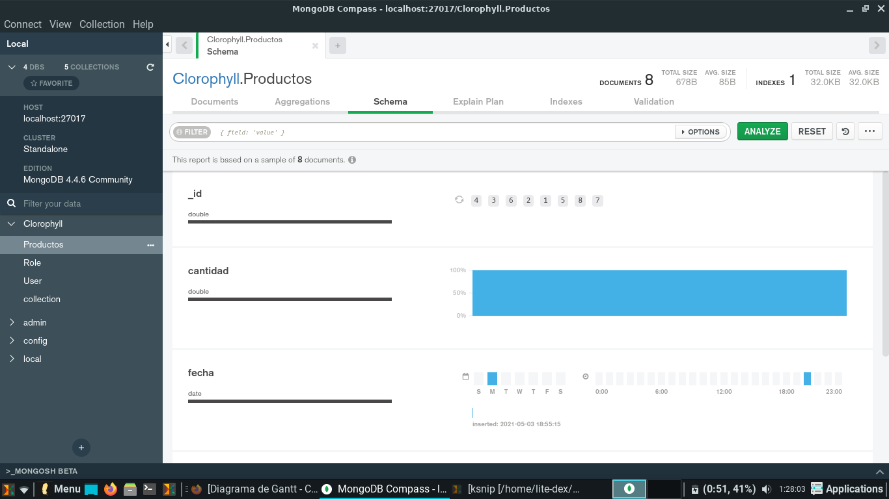


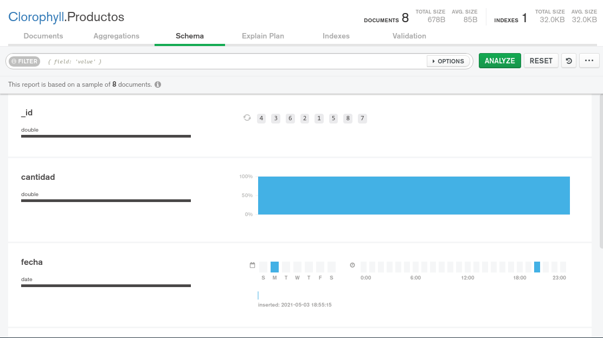


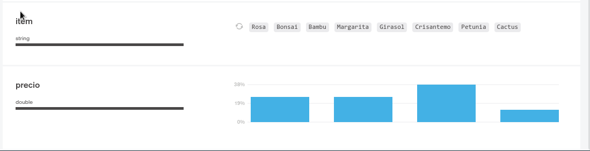


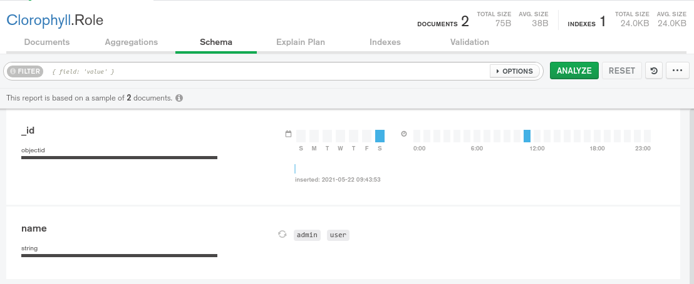


**Ejemplo Indice:**


**Ejemplo Documento:**


**Autentificación**.


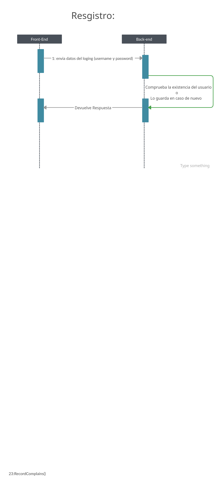


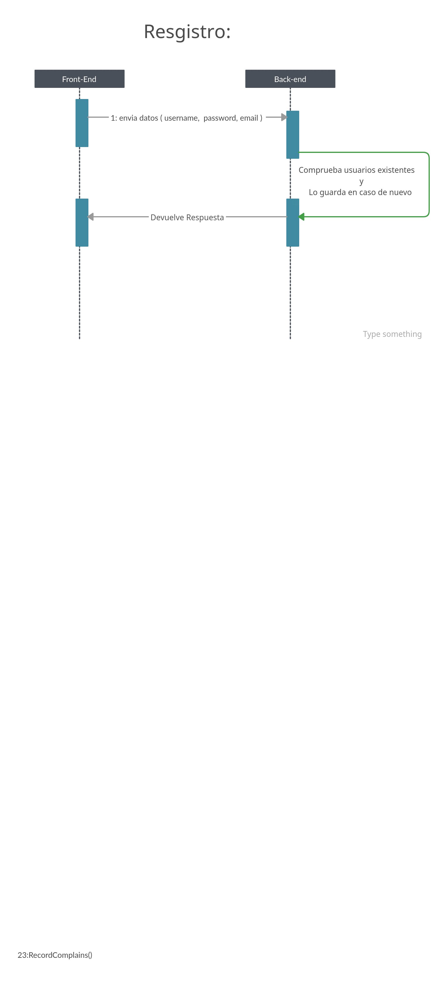


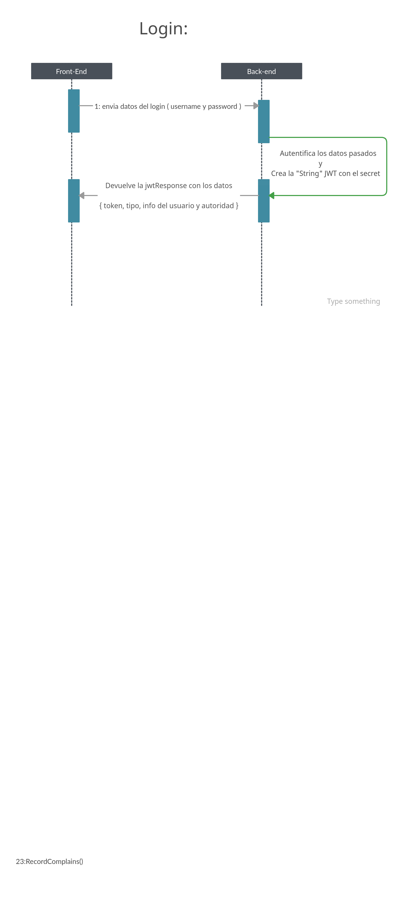


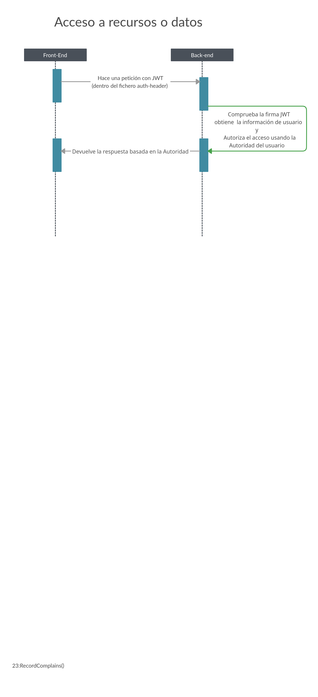


**Rutas y Visión General**


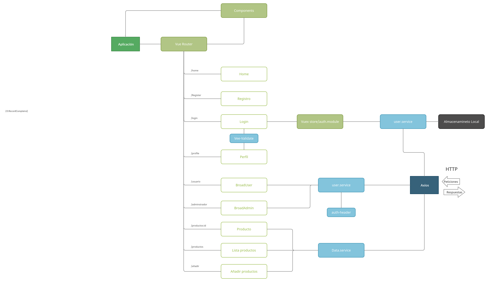


### Codificación

En este apartado se expondrá la Codificación o construción de la aplicación.

Primero antes que nada se necesita realizar las operaciones principales necesarias, lo primero iniciar el repositorio con npm para poder empezar el proyecto, y hacer uso de las dependencias que ayudaran a lo largo del desarrollo de la aplicación.


Estas son las dependencias instaladas e utilizado a lo largo de este proceso, a continuación se deja una lista sobre ellas y el para que se utilizan.

Express: el *Web framework* que se va utilizar a la hora de construir la *API*.

Axios: Es un tipo de cliente HTTP basado en *Promises*, axios realiza peticiones http atraves de node.js y Intercepta e Transforma datos de las requests y responses.

Bcrypt: es un algoritmo de cryptografia de tipo *hashing* , recommendado para hacer hashing de contraseñas, el cual utilizaremos más adelante en la parte de **autentificación**.

BodyParser: Node.js body parsing middleware. Parse incoming request bodies in a middleware before your handlers, available under the req.body property.

Cors: Cross-Origin Resource Sharing (CORS) is an HTTP-header based mechanism that allows a server to indicate any other origins (domain, scheme, or port) than its own from which a browser should permit loading of resources.

dotenv: Dotenv is a zero-dependency module that loads environment variables from a .env file into process.env. Storing configuration in the environment separate from code is based on The Twelve-Factor App methodology.

Mongodb: Driver oficial de *Mongodb*.

Mongoose: Mongoose is a MongoDB object modeling tool designed to work in an asynchronous environment. Mongoose supports both promises and callbacks, se usará más adelante.

Dependencias Globales: 

(Instaladas en el equipo pueden ser usadas desde cualquier parte.)

nodemon: Nodemon is a utility , that will monitor for any changes in your source and automatically restart your server.

eslint: Find and fix problems in your JavaScript code.

Mocha: Mocha is a feature-rich JavaScript test framework running on Node.js and in the browser, making asynchronous testing simple and fun.

Chai: assertion library for node and the browser that can be delightfully paired with any javascript testing framework.

Una vez explicadas las dependencias proseguimos con la explicación:

La construción de esta aplicación se llevo acabo, separandolo todo en bloques, primero se empezo con el lado servidor o *back-end* en el que como se explico al principio uno de los objetivos principales era aprender a construir una *API* que funcionse con todas las partes necesarias.

el proyecto final tiene la siguinete estructura:

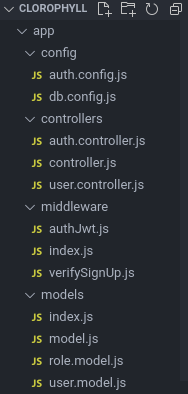

El tipo de *API* que se va a construir es una *RESTfull* *API*, 


**Server.js**

Ahora se da comienzo a la primera tarea construir o "instanciar" el propio servidor, para ello se crea el fichero server.js donde añadiremos rutas abriremos el puerto a utilizar y conectaremos con la base de datos.

La estructura del "fichero servidor" definitiva es la siguiente, paso por paso se explicará como hacerlo todo:

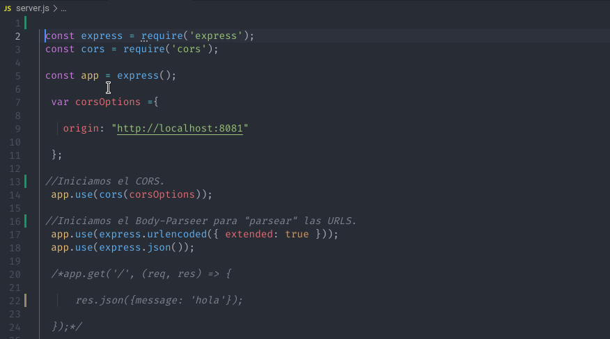

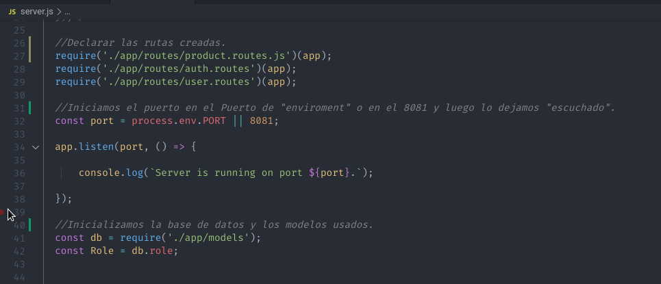


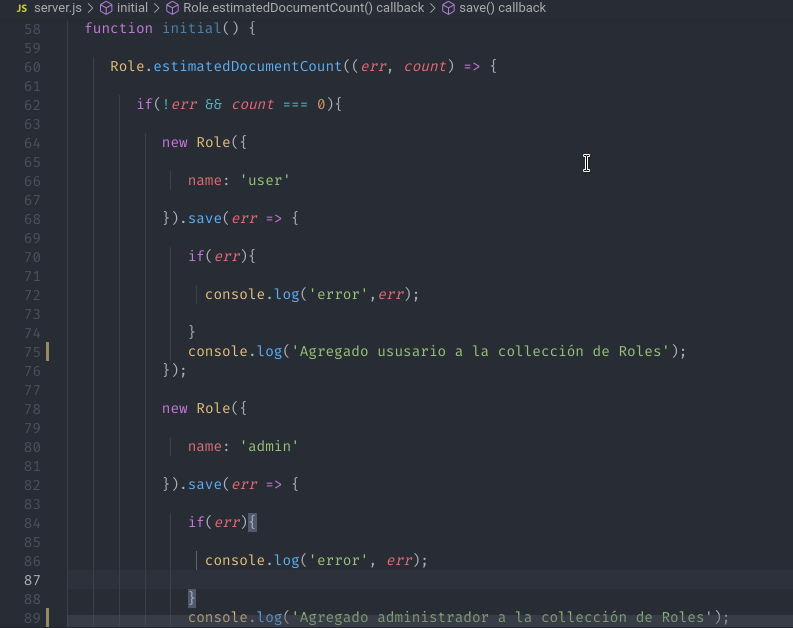


Lo primero hemos de "exportar" los drivers o dependencias que vamos a usar, en este caso express y cors.

Se inicializa la app "igualandola" a express para utilizar la constante app a la hora de construir el resto de funciones.

Una vez echo eso, prosigue configurando las opciones del *Cors* dejando el origen en el localhost y el puerto a utilizar.

Para continuar Inicializamos el cors usando las opciones previamente especificadas.

Deberia quedar así.


Una vez declarado lo anterior se declaran las rutas ha utilizar de las cuales hablaremos más adelante con mayor detenimiento.

Una vez declaradas proseguimos a iniciar el servidor, se crea la constante port.

La cual esta igualada a el puerto 8081 o bien al puerto del "enviroment" esto se utiliza por el echo de que luego el proyecto se va a subir a heroku.

De esta forma se puede ahorrar problemas innecesarios a la hora de subirlo a heroku, de normal en local utilizara el puerto 8081.

Una vez terminado se instancia la Base de Datos y declaramos el fichero index.js dentro de la carpeta models.

Y la constate Role que referencia a la colección role de la base de datos.


Una vez terminada con esa parte creamos la conexión a la base de datos pasando el host puerto y base de datos usada por medio de unas variables creadas en el propio fichero de configuración db.config.js.

De la siguiente froma:

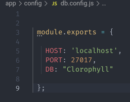

Y a continuación emplea el body-parser para *parsear* la url utilizada.

Se crea una consecuente función *.then()* para comprobar la conexión a la BD.

Y un Catch para obtener el error consecuente y salir del proceso.


Una vez terminado, generamos una funcion para comporbar la creación de los dos tipos de usarios.

Donde se recojen los posibles errores dentro de una serie de ifs, y en caso de acierto se comprueba con un mensaje la agregación del Role de usuario


Una vez explicadas las funciones creadas en el fichero servidor.

Se les va a dar contexto y explicación a raiz de la explicación de los siguientes aparatados.

**Config**

En este apartado se van a dejar configuradas las partes de configuración tanto de acceso al a BD como de autenticación.

De este fichero se habló previamente en la parte del server, su finalidad es no utilizar de forma directa la URL otrogandole un poquillo más de seguridad al utilizarla.

Aparte de esta froma no se tiene que repetir la URL de forma constante cada vez que se necesite.

La froma en la que funciona es utilizando el module.exports para poder exportarlo al resto de lugares donde se neceste.


En el siguiente fichero de configuración seguimos el mismo proceso anterior, pero en este caso creamos las clave secerta de la autenticación.

Dentro de un module.exports para poderlo exportar a donde se necesite.


Y con esto se da por terminado este apartado.

**Modelos**

Los Modelos permiten generar un esquema el cual se seguira a la hora de crear nuevos datos realacionados a una colección concreta.

para la creación de estos modelos se utilizó *mongoose*, el cual permite generar Schemes, o esquemas conectando directamente con la BD para o bien crear colecciones las cuales se generan en caso de no existir al realizar ya o simplemente se agreagan los datos a la coleción creada.

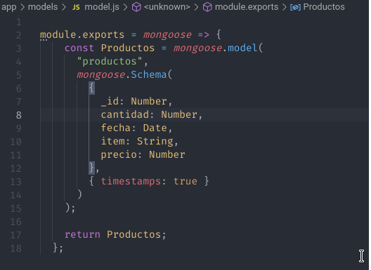

En este modelo se puede ver como se crea el esquema que siguen todos los items o productos, dentro de la colección productos.

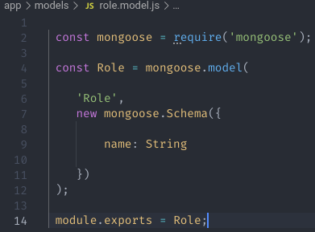

En este modelo se define el indice de la coleción Role el cual es solamente un campo name de tipo string, aparate de una id que te autogenera *Mongo* si no la creas tu manualmente.

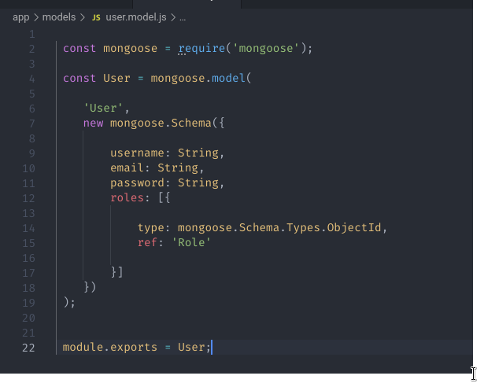

Aqui se crea el modelo de la colección User de usuario, pero realizando algo que no se habia echo antes.

Y eso es referenciar a la colection Role para que los usuarios tengan un rol como atributo.

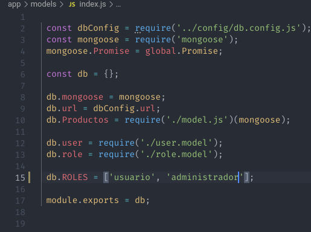

Como podemos ver en este caso, el fichero index que se va a llamar como se ha visto en el en el server.js, aqui llamamos al fichero de configuración anterior, para poder conectar con la BD y también los otros modelos para poder ser usados solo con llamar al index dentro de models.


**Middleware**

En esta parte se van a confecionar los middleware o por así decirlo pasos intermendios.

En este caso el middleware que se va a utilizar son dos tipos de uno de auntenticación y uno de verificación.

Esto son dos practicas muy importantes a la hora de utilizar una función de autentificación.


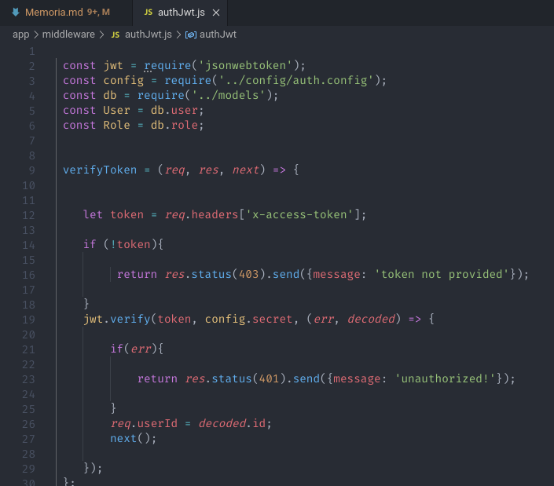


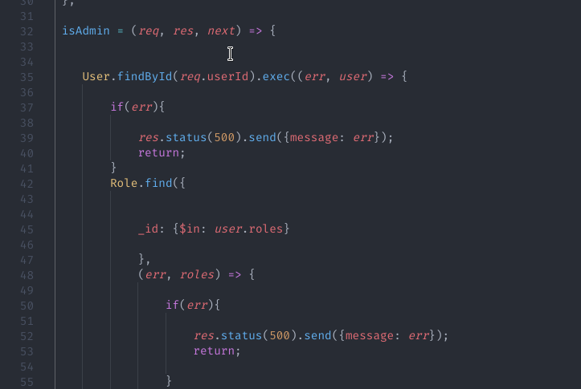


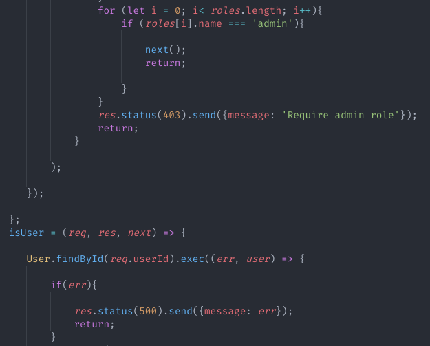


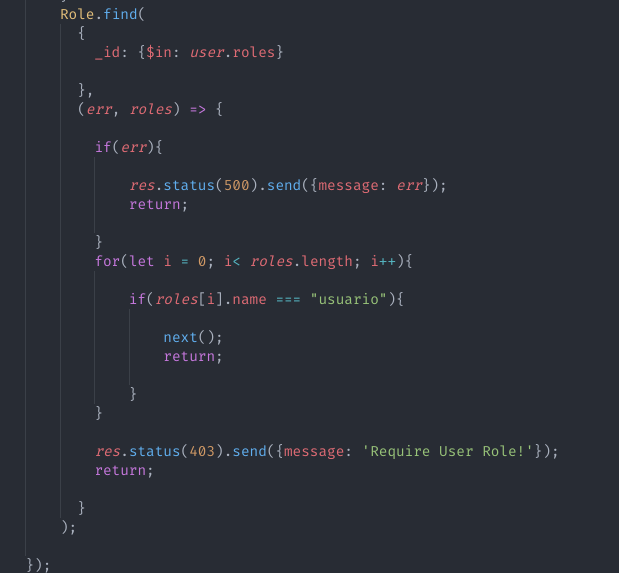


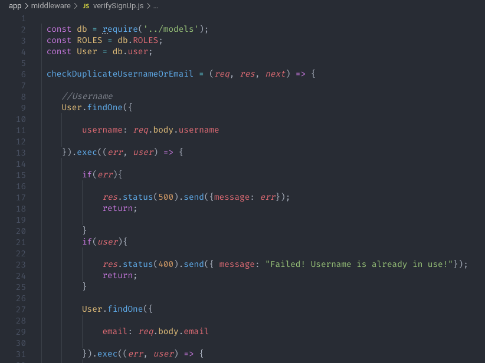


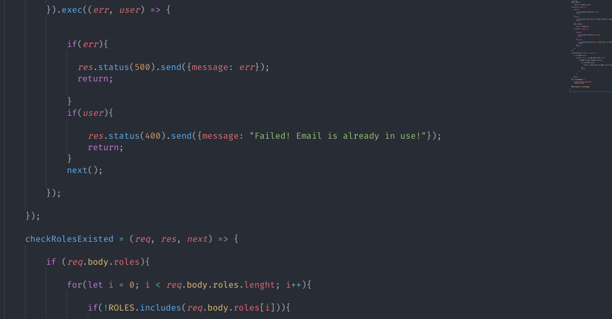


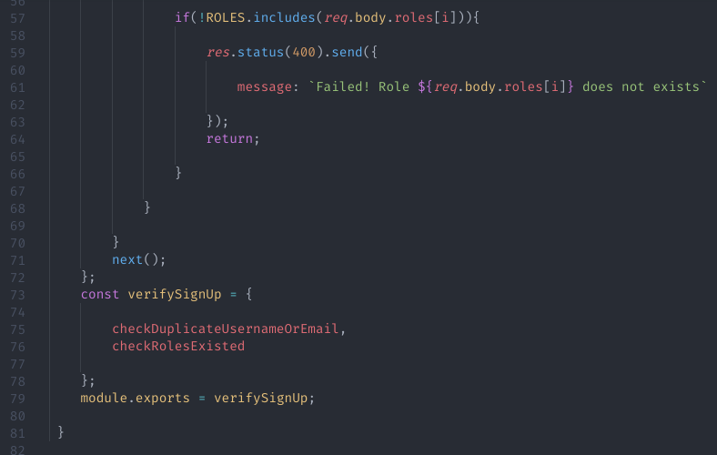


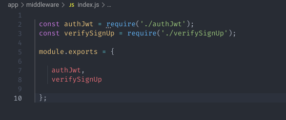

Aqui tenemos el fichero index, para poder "centralizar" y no tener que llamandar a todos los ficheros para utilizarlos de forma especifica.

exportas las constantes con module.exports y así termina este apratado.

Luego estas variables se utilizaran en los proximos apartados.


**Controladores**

Los controladores premiten realizar operaciones de todo tipo, las cuales luego vamos a exportar más tarde para poder realizar estas funciones.


En este caso los controlaodores creados sirven para distinguir los tipos de acceso. luego más adelante en el *Front-end* se dearrollará más este tema.


Con los siguientes controladores se desarrollará el sistema de *CRUD* con el que podremos realizar una serie operaciones las cuales más a delante se explicarán con más detenimiento. 


Este Controlador sirve para Crear un nuevo Producto, a base de exportar el modelo y declarar la creación de un nuevo producto. 

Por el cual los datos se pedirán através de la sentencia req.body.elemento_en_cuestión.

despues de eso guardamos el proyecto y como respuesta enviamos los datos.

también tiene un catch para recojer los errores.

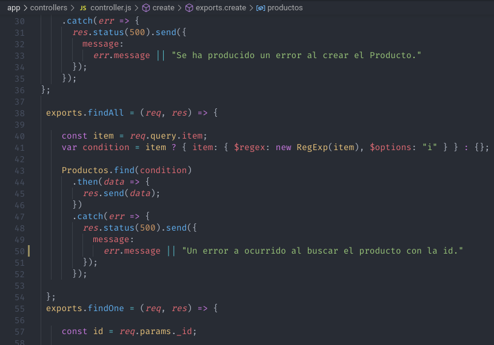
 
Este controlador se utiliza para encontrar todos los productos. 

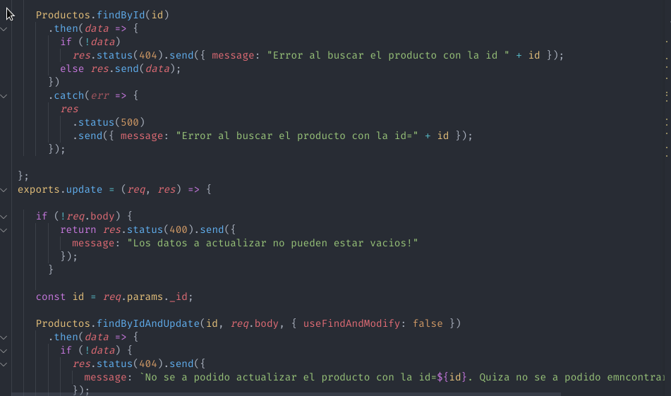

Este controlador se utiliza para encontrar un productos. 

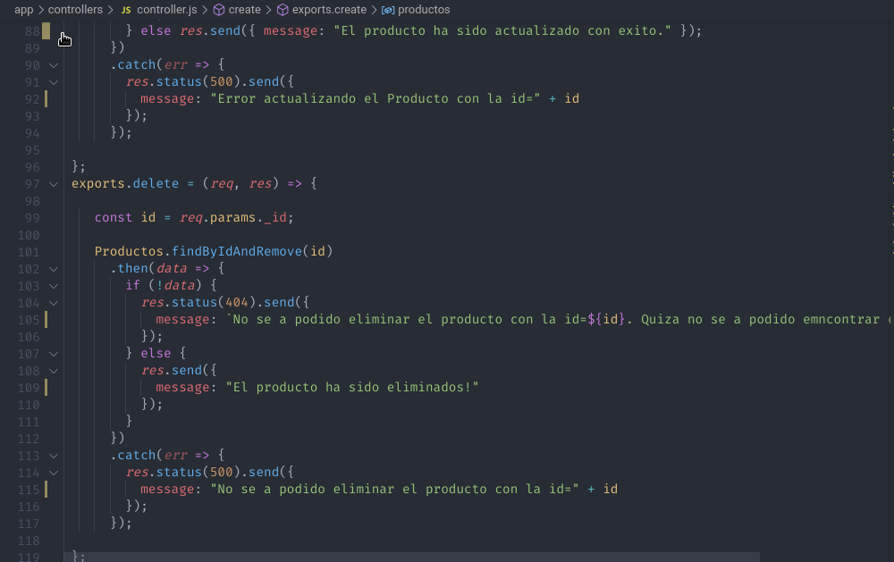

Este controlador se utiliza para eliminar un producto. 

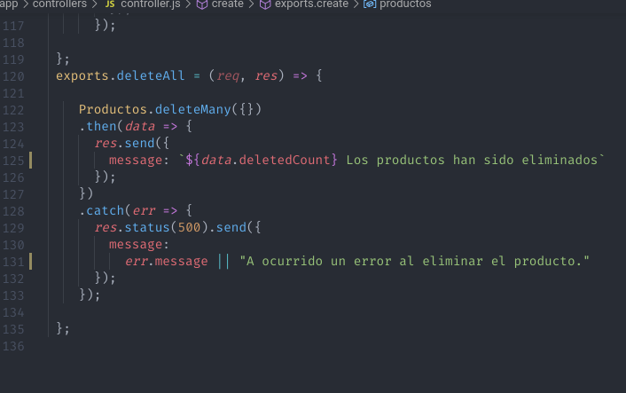

Este controlador se utiliza para eliminar todos los productos. 

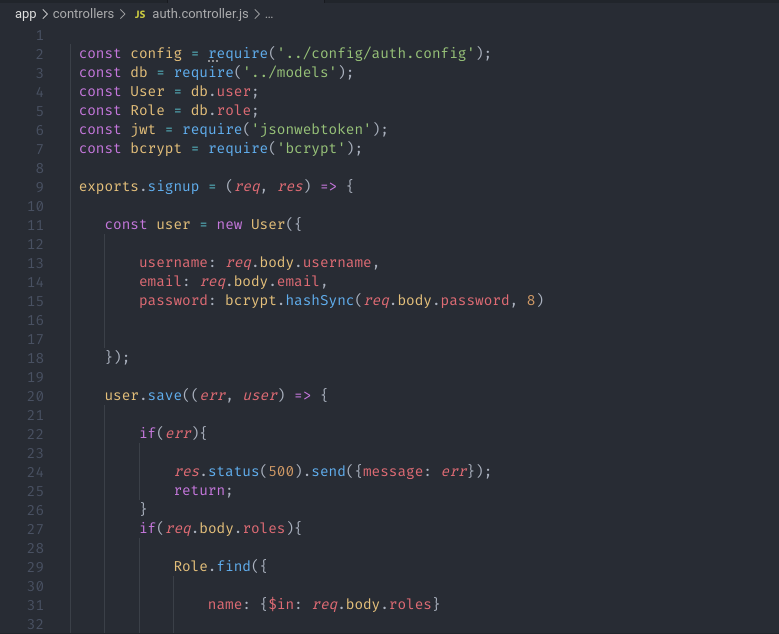

Estos controladores nos permiten registar, guardar y encontrar el tipo de Role de usuario. 

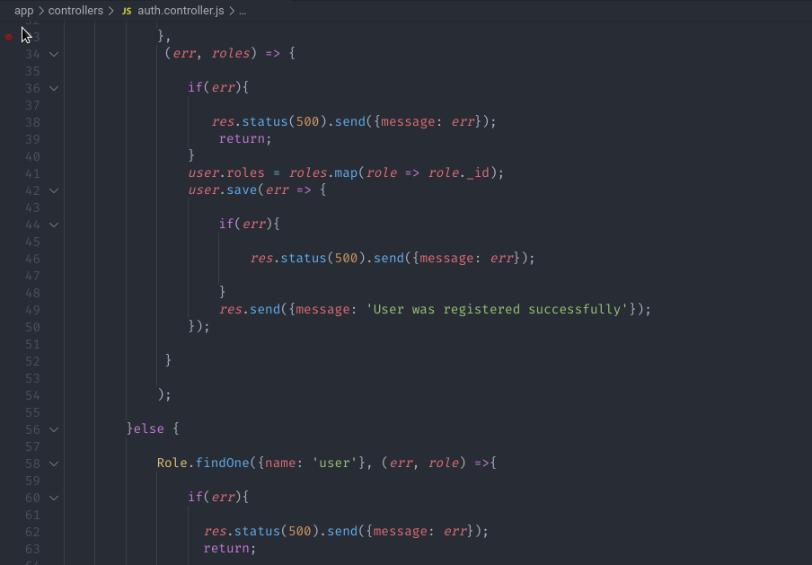


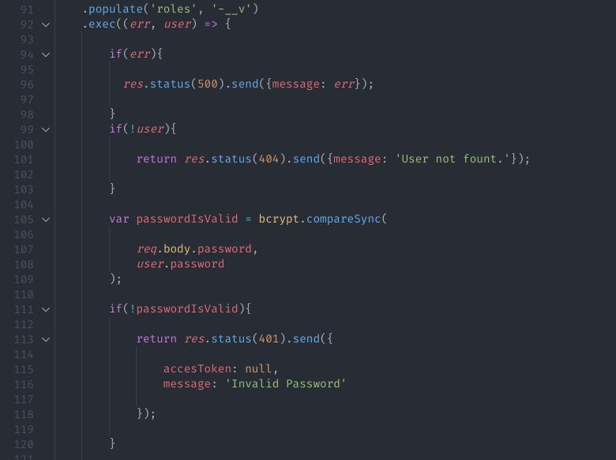

En este Controlador Podemos encontrar un usuario ya Creado.


Y de esta dorma generamos un controlador para logear al usuario henerando un token de JWT que dura unas 24h aprox.

**Rutas**

Las rutas permiten crear direcciones a las cuales se podra acceder una vez se purebe o use la aplicación.

Estas rutas contienen un tipo especifico de funcionalidad de ahí la razón por la que existen, para implementar diferentes tipos de funciones en diferentes sitios y no tenerlo todo en uno.

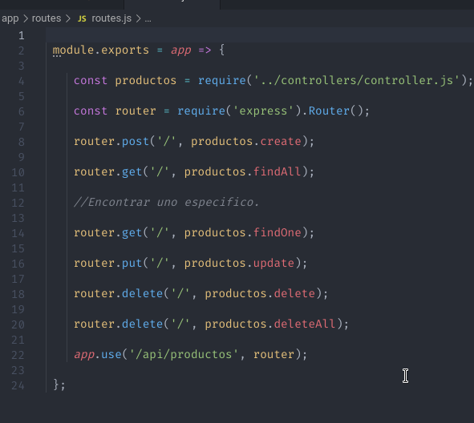

En este segmento lo que se realiza es, importar los controladores creados previamente e importar el router de express.

Despues generamos las rutas de tipo *GET* *POST* *PUT* y *DELETE* cada una desde '/' referenciando al home o al indice, y apartir de ahí se llama a cada una de las opciones creada en el controlador.

Una vez usados todos los controladores, iniciamos la ruta usando el app.use declarando el normbre de la ruta concreta y al final llamando al router.


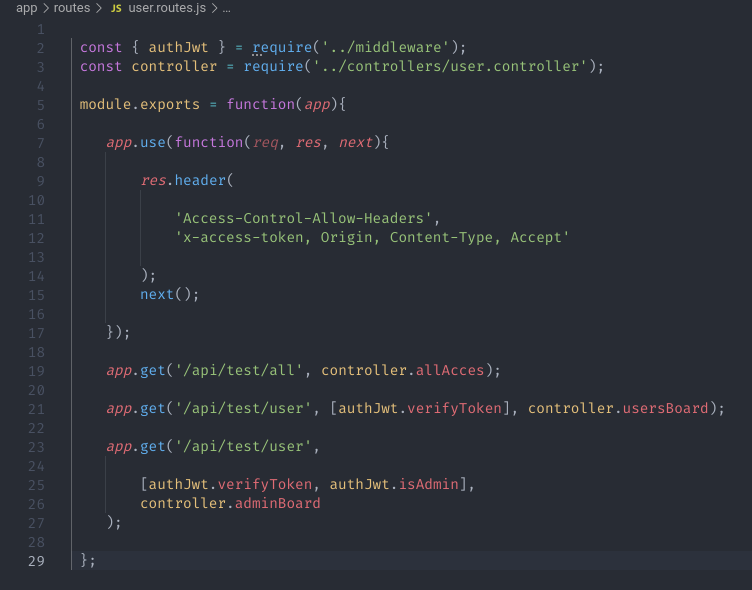


Esta ruta se va a utilizar para la autentificación.


por esa razón se llama al controlador user o usuario para poder accerder más adelante a las funciones creadas en este controlador, aparte del middleware de autentificación.

primero declaramos los tokens que se envian en el header

y acontinuación creamos las rutas para cada tipo de usuario, llamando en cada una controlador y al middleware necesario.

Tanto en la parte de usuario como de verificamos el token y despues en el caso de usuer se llama al controlador usersBoard.

Y en el caso del Admin se llama al middleware IsAdmin y luego al controlador adminBoard.


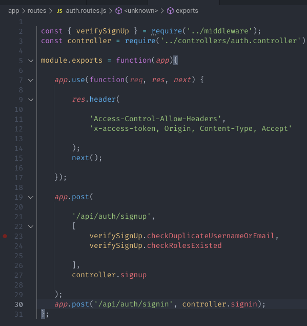


Y en este caso como en el anterior se llama a otro tipo de middleware, en este caso el verifySignUp.

Como se ha visto antes tanto el middleware anterior authJWT como el usado ahora verifySignUp son exportados a la hora de llamar al index donde estan declarados como variables exportables.

La finalidad de esta ruta es utilizar las funciones generadas de verificación para poder verificar el registro.

Por esa razón en la primera función, usamos 'Acess-Control-Allow-Headers', 'x-access-token, Origin, Content-Type, Accept'.

De esta manera el servidor responde con un header donde se pasan una serie de datos necesarios.

una vez terminado con los header, en la siguiente función utilizamos las funciones declaradas en el controlador verifySignUp que nos permiten comprobar los campos o datos que nos importan en el registro.


Una vez explicado este punto pasemos a la explicación del *Front-end*:

Lo primero que se necesita saber es como crear el repositorio inicial sobre el que se desarrollará el proyecto, en el caso de Vue-cli lo unico que es necesario es en la linea de comandos utilizar el siguiente comando:

Esto nos generará un arcuvo basico con sus ficheros y configuraciones tanto predeterminadas como escogidas por el usuario de forma manual.

la estructura del front-end es así:


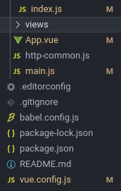

**main.js**


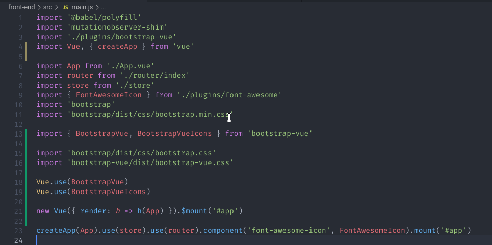

**http-common.js**


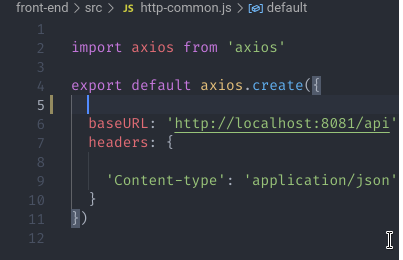

**App.vue**


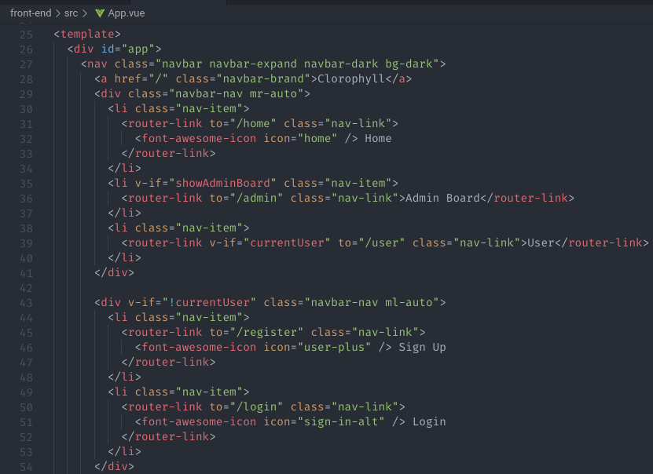


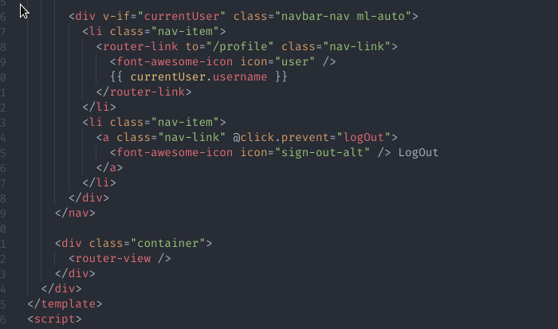.


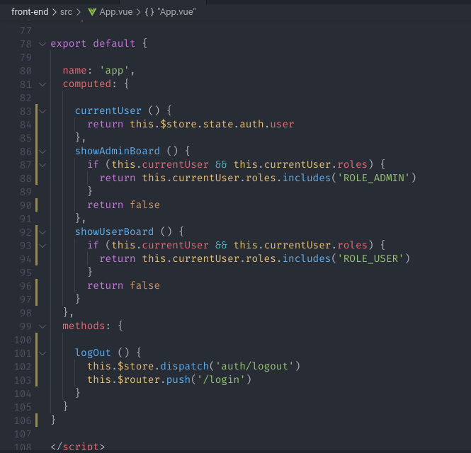


**Components**


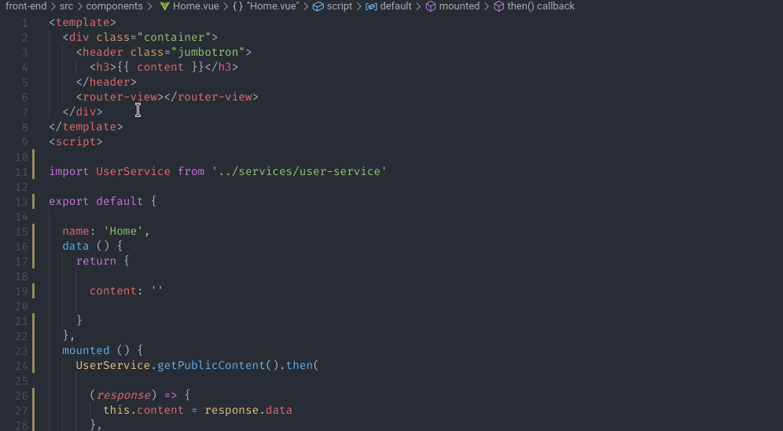


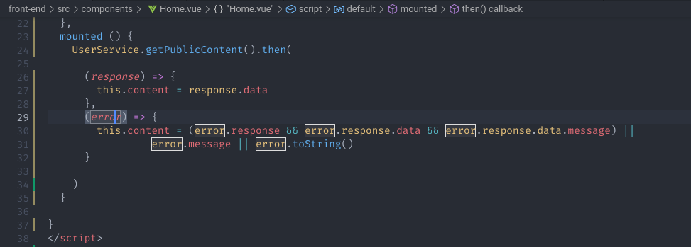


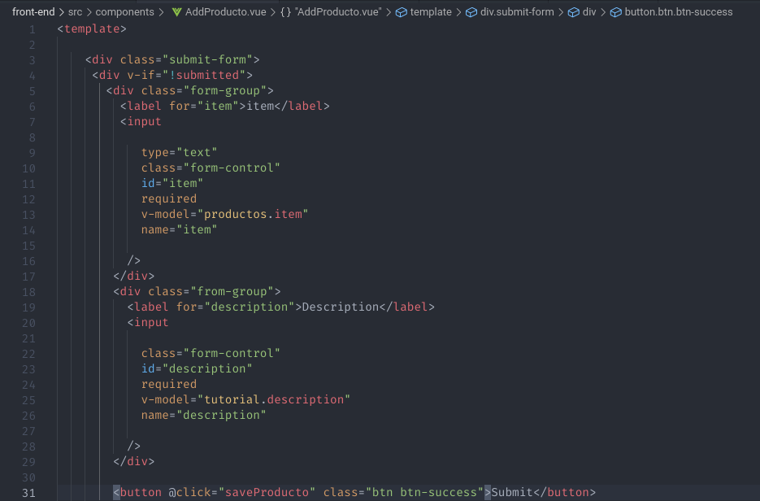


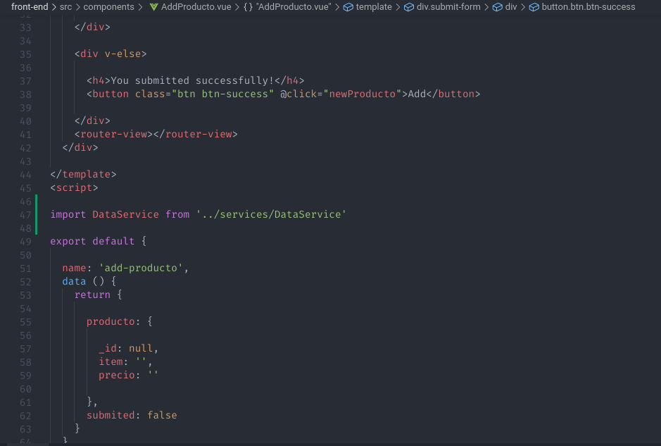


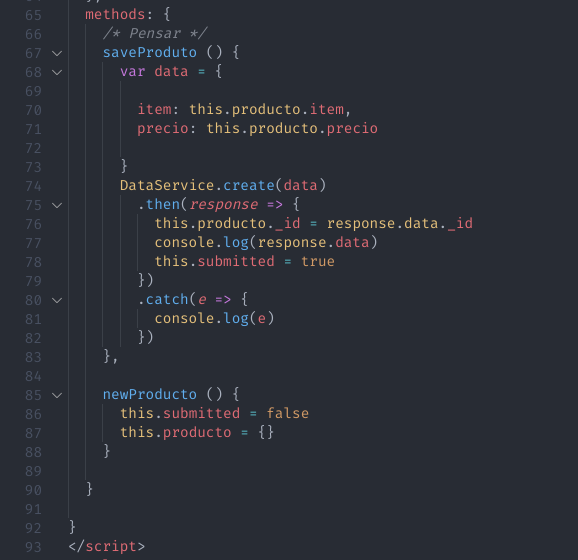


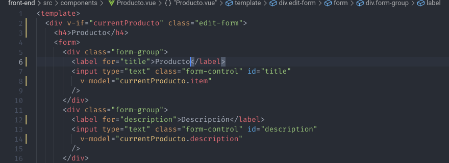


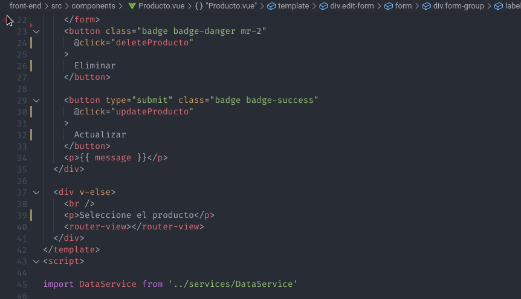


**router**


**store**


**services**


**vue.config.js**


#### CRUD

En este apartado se dara más explicación al apartado de *CRUD*, más allá de la pequeña explicación que se dió en el apartado anterior.

Segund mdn:

El "CRUD (Create, Read, Update, Delete) es un acrónimo para las maneras en las que se puede operar sobre información almacenada. Es un nemónico para las cuatro funciones del almacenamiento persistente. CRUD usualmente se refiere a operaciones llevadas a cabo en una base de datos o un almácen de datos, pero también pude aplicar a funciones de un nivel superior de una aplicación como soft deletes donde la información no es realmente eliminada, sino es marcada como eliminada a tráves de un estatus".

Esta pequeña explicación esquematiza perfectamente lo que quiere significar el *CRUD* siendo un conjunto de operaciónes basicas o esenciales a la hora de manejar datos entre el cliente y el servidor, sirviendo como una pieza principal dentro del conjunto de la aplicación.

Sin el CRUD no se podria recojer datos, actualizarlos, eliminarlos, o visualizarlos.

#### Autentificación

En este apartado se dara más explicación al apartado de Autentificación, más allá de la pequeña explicación que se dió en el apartado principal.

El tipo de autentificación utilizada es por *tokens* utilizando JWT.

Llegado a est punto se ha podido ver como declararlos y utilizarlo, peor no se ha realizado una explicación más allá de 

### Pruebas

En este apartado se va a comentar todo el temario relacionado con las practicas que se han podido realizar.

Antes de comenzar este narrador se ha de disculpar por la falta de material relacionado al apartado de pruebas.

No es motivo de escusamiento o de escusa mejor dicho pero la falta de tiempo ha jugado un papel crucial dentro de la preparación del proyecto.

Aún así se han podido realizar varias pruebas en sobre la api en sus primeras fases.

Las pruebas se realizarón con *Postman* una aplicación que permite realizar peticiones de tipo *GET*, *POST*, *PUT* y una gran variedad de protocolos distintos.

Estas pruebas pruebas permitián conocer el propio estado de las peticiones y si estas no daban fallo al ser enviadas.

Las del Tipo que se hicieron fueron de tipo *GET* y *POST*, dando buenos resultado.

más adelante el tipo de pruebas que se han realizado han sido sobretodo en el *Front-end* el cual al poseer *webpack* y *ESlint*, permitia realizar las pruebas de una forma rapida y corregir los errores con un solo comando.

Para poder compilar la aplicación se necesitaba utilizar el comando npm run build, el cual es un script autogenerado a la hora de la cración del proyecto.

Ese script llama a la función de vue ya predefinida: vue build.

Un ejemplo de resultado seria el siguiente:


Para utilizar ESlint bastaria con usar el comnado npm run lint que también es un script autogenerado en la creación del proyecto.

Un ejemplo de lint seria el siguiente:


Aparte de eso se tenia pensado realizar otro tipo de tests, *API Testing* los cuales realizán una distinta serie de pruebas sobre la *API* seleccionad.

Se iban a realizar con *mocha.js* el cual es un *framework* de *API Testings* y chai que es una libreria de asserciones.

Pero Gracias a la falta de tiempo no existe la posibilidad de documentarlo, con lo cual solo se reduce a un se quiso pero no se pudo.

Una vez terminado este apartado concluomos con las conclusiones (valga la redundancia).

## Conclusiones

En este apartado sacaremos las diversas conclusiones que se han sacado de la resolución y desarrollo de este proyecto.

Partiendo de la Idea original o los motivos principales por los cuales se desarrolla la intriga o motivo de realizar el preciso proyecto con su tematica explicita y con los factores ya explicados.

Lo que se a podido ver con claridad en el proceso es falta critica de tiempo, para terminar al  100% el desarrollo de la applicación.

En la ocasión de haber tenido la capacidad de "materializar" más tiempo para el mismo, podría haberse realizado por completo, aún así no se a qedado muy lejos de su supuesto estado final, completando los motivos principales ya explicados.

En definitiva la cantidad de tecnologias y conocimientos nuevos aún partiendo de un "puerto conocido" de nombre *JavaScript*, que se han tenido que asimilar en un corto perido de tiempo han permitido probar las capacidades limite y dar un entendimiento de la situación presente en el ambito de desarrollo en *JavaScript*.

Lo cual presenta una clara dualidad, pues es bueno ya que la mejor forma de entender el propio "sistema" y situación actual de este tipo de desarrollo, es buceando entre las profundas y oscuras cavidades submarinas que habitan en lo más profundo de su "medioambiente".

Pero es malo debida a la situación tán apresurada en la que nos situa, dejando un corto margen de acción sobre el que no se puede actuar de forma tan detenida o pausada y en este caso esta situación penaliza el propio desarrollo de este tipo de aplicación.

Una vez sacadas las conclusiones principales proseguimos con el siguiente punto.

### Tiempo invertido

En este apartado se mostrará el desglose temporal que se ha invertido de verdad en el proyecto, para dar un toque más realista al propio desarrollo final.

Gracias a la falta de tiempo comentada previamente, es de esperar que el equema de planificación temporal no represente verdaderamente la cantidad de tiempo invertida en el proyecto, por esa razón la existencia de este apartado y su función.

Una vez explicado el porque del apartado, se porcede a la muestra del Diagrama en cuestión:


### Partes Inconclusas

En este apartado se aclarara el porque de las partes inconclusas.

### Planes a Futuro

En este apartado se explica los planes de futuro de la aplicación, sirviendo de continuación del apartado anterior.

Los planes de futuro para con esta aplicación estan bastante claros, lo principal es mejorar el rendimiento de la app por medio del *framework* de *front-end* *Vue.js*.

Desarrollo de un mejor sistema de carrito o chart en ingles, el cual sea mucho más funcional.

Mejorar los aspectos de diseño pertinentes para generar una mejor experiencia para con el UI/UX.

Mejorar las funciones de autentificación.

Mejorar el *CRUD*.

Mejorar la autentificación, implementando *Auth0*.

## Integración de modulos dentro del proyecto


1ºDAW. Sistemas Informáticos: Por mucho que se hayan realizado conexiones y peticiones por el protocolo http en este casó no a sido necesario aplicar los conocimientos aprendidos en este mosulo.

1ºDAW. Base de Datos: Aunque en un tipo de Base de Datos, pero si a la hora de comprender y enteder el funcionamiendo e integración de *Mongodb* han sido necesarios los conceptos aprendidos en este modulo.

1ºDAW. Lenguaje de Marcas: Absolutamente, se han utilizado los conceptos aprendidos en este modulo, sobretodo a la hora de implementar el *HTML/CSS*.

1ºDAW. Programming: Aún desarrollando en otro lenguaje, toodos los conocimientos empleados en este modulo han sido requeridos.

1ºDAW. Entornos de Desarrollo: Absolutamente, esta memoria en si es un ejemplificación clara de la manifestación latente de los conocimientos impartidos en este modulo.

2ºDAW. Desarrollo Web en entorno Servidor: Si lo """aprendido""" en este modulo ha sido necesario.

2ºDAW. Despliegue de aplicaciones Web: Si lo """aprendido""" en este modulo ha sido necesario.

2ºDAW. Desarrollo Web en Entorno Cliente: Todo lo aprendido en este curso se a empleado al maximo posible.

2ºDAW. Diseño de Interfaces Web: los conocimientos aprendidos en este modulo han sido completamente necesarios.

## Glosario

### Terminos Empleados:

API:
front-end:
back-end:
Webpack:
Angular.js:
Vue.js:
React.js:
Svelte.js:
Mongodb:
Express:
Node.js:
Web Framework:
Fastify:
NoSQL:
deno:

## Bibliografia

### Información consultada

Sacha Greif and Raphaël Benitte, (20 de mayo de 2020). State of JS. <https://2020.stateofjs.com/en-US/>

Sacha Greif and Raphaël Benitte, (20 de mayo de 2020). State of CSS. <https://2020.stateofcss.com/en-US/other-tools/>

El equipo de Vue.js. (2021-03-24). Introducción a Vue.js. <https://v3.vuejs.org/guide/migration/introduction.html#quickstart>

El equipo de Vue.js. (10/7/2019). Introducción a Vue.js cli. <https://cli.vuejs.org/guide/>

El equipo dec Sass. (2006–2021). Documentación de Sass. <https://sass-lang.com/documentation>

El equipo de Git. (Sin especificar). Documentación de Git. <https://git-scm.com/doc>

El equipo de Node.js. (20 de mayo de 2020). Node.js v14.16.1 Documentación. <https://nodejs.org/dist/latest-v14.x/docs/api/>

Apellido, A., Apellido, B., y Apellido, C. (CR: en febreo pero no se especifica dia). Nodemon. <https://www.npmjs.com/package/nodemon>

El equipo de bitbucket altassian. (Sin especificar). .gitignore. <https://www.atlassian.com/git/tutorials/saving-changes/gitignore>

El equipo de Express.js. (20 de mayo de 2020). Primer programa echo e en Express. <https://expressjs.com/en/starter/hello-world.html>